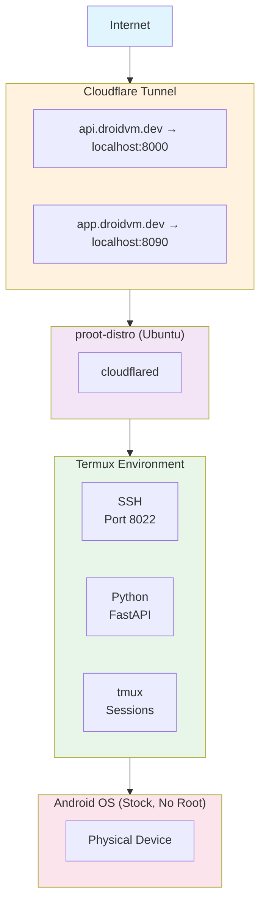

# DroidVM

> Turn your old Android phone into a cloud-accessible server. No root required.

[](https://api.droidvm.dev/status)
[](LICENSE)
[-blue)](https://termux.dev)

---

## What is DroidVM?

DroidVM transforms old Android phones into tiny, cloud-accessible servers. Your phone becomes a legitimate cloud node with:

- **Real domains** (api.yourname.dev) via Cloudflare Tunnel
- **Automatic HTTPS** and DDoS protection
- **No port forwarding** or ngrok limitations
- **24/7 availability** with proper session management

**Live Example:** [https://api.droidvm.dev/status](https://api.droidvm.dev/status) - Real-time stats from an actual phone in a drawer.

---

## Why DroidVM?

- **Free cloud VM** - You already own the hardware
- **No monthly fees** - Unlike traditional cloud providers
- **Eco-friendly** - E-waste becomes infrastructure
- **Low power** - ~5W vs 50-100W for a traditional server
- **Learn by doing** - Linux, networking, tunneling hands-on

---

## Quick Start

```bash
# On your Android phone with Termux installed:
curl -fsSL https://raw.githubusercontent.com/myselfshravan/droidvm/main/setup.sh | bash
```

Or clone and run:
```bash
git clone https://github.com/myselfshravan/droidvm.git
cd droidvm
chmod +x setup.sh
./setup.sh
```

The interactive setup wizard will guide you through:
1. Installing base packages (openssh, tmux, python, etc.)
2. Configuring SSH access on port 8022
3. Setting up tmux for session persistence
4. Installing Python environment
5. Configuring Tailscale for private VPN access
6. Setting up proot-distro with Ubuntu
7. Installing DroidVM Tools API

---

## Features

### Access Methods

| Method | Use Case | Example |
|--------|----------|---------|
| **Local WiFi** | Same network | `ssh -p 8022 user@192.168.1.x` |
| **Tailscale VPN** | Private, anywhere | `ssh -p 8022 user@100.x.x.x` |
| **Cloudflare Tunnel** | Public internet | `https://api.droidvm.dev` |

### DroidVM Tools API

FastAPI-based monitoring and management:

```bash
# System information
curl https://api.droidvm.dev/status

# Individual endpoints
curl https://api.droidvm.dev/system/memory
curl https://api.droidvm.dev/system/cpu
curl https://api.droidvm.dev/system/processes
curl https://api.droidvm.dev/network/info
```

**API Documentation:** [https://api.droidvm.dev/docs](https://api.droidvm.dev/docs)

### CLI Tools

```bash
droidvm-tools status     # Comprehensive overview
droidvm-tools memory     # Memory usage
droidvm-tools cpu        # CPU information
droidvm-tools network    # Network interfaces
droidvm-tools tmux       # List tmux sessions
droidvm-tools status --json  # Full JSON output
```

---

## Architecture



---

## Requirements

### Hardware
- Android phone (Android 7+, tested on Android 14)
- ARM64 architecture (most modern phones)
- 2GB+ RAM recommended
- WiFi connection

### Software
- [Termux](https://f-droid.org/packages/com.termux/) (F-Droid version recommended)
- Battery optimization **DISABLED** for Termux
- (Optional) Cloudflare account for public domains
- (Optional) Tailscale account for private VPN

---

## Use Cases

- **Personal API server** - Host your own REST APIs
- **Webhook receiver** - GitHub, Stripe, Discord webhooks
- **Home automation hub** - Control IoT devices
- **Development testing** - Test on real ARM hardware
- **File sharing** - Personal cloud storage
- **Learning platform** - Practice Linux, networking, DevOps

---

## Documentation

- [Complete Technical Context](docs/DROIDVM_CONTEXT.md) - Deep dive into architecture
- [Open Source Plan](docs/OPEN_SOURCE_PLAN.md) - Project roadmap and structure
- [Project Summary](docs/PROJECT_SUMMARY.md) - High-level overview
- [Cloudflare Tunnel Guide](docs/context_cloudflare.md) - Setting up public domains
- [ngrok Setup Guide](docs/context_ngrok.md) - Alternative public access method

---

## Known Limitations

Due to Android/Termux sandboxing, some system info is unavailable:

**Not Available:**
- Battery info (can't access `/sys/class/power_supply`)
- CPU frequency (can't read kernel freq info)
- Network I/O counters (permission denied)

**Works Perfectly:**
- Memory usage (total, available, used)
- Process listing and management
- tmux session management
- Disk usage for specific paths
- Network hostname and connectivity

---

## Tech Stack

```yaml
Base: Android (stock, no root) + Termux
Linux: proot-distro with Ubuntu
Python: 3.12 with uv package manager
API: FastAPI 0.103.2 + Pydantic v1.10
Server: Uvicorn 0.23.2
Session: tmux
SSH: OpenSSH (port 8022)
VPN: Tailscale
Tunnel: Cloudflare Tunnel (cloudflared)
```

**Note:** Uses Pydantic v1.x to avoid Rust compilation requirements on ARM.

---

## Contributing

Contributions welcome! Whether it's:
- Bug fixes
- Documentation improvements
- New features
- Testing on different devices
- Sharing your DroidVM setup

Please open an issue or submit a PR.

---

## Roadmap

- [ ] One-command installer improvements
- [ ] Web dashboard for monitoring
- [ ] Docker-like container support
- [ ] Automated backup solutions
- [ ] Multi-phone cluster support
- [ ] docs.droidvm.dev (hosted on the phone itself!)

---

## License

MIT License - See [LICENSE](LICENSE) file.

---

## Acknowledgments

- [Termux](https://termux.dev) - Terminal emulator for Android
- [Cloudflare](https://cloudflare.com) - Tunnel and DNS services
- [Tailscale](https://tailscale.com) - Zero-config VPN
- [FastAPI](https://fastapi.tiangolo.com) - Modern Python web framework
- [proot-distro](https://github.com/termux/proot-distro) - Linux distributions in Termux

---

## The Inception

This README describes how to run servers on your phone. The API it documents runs on a phone. Soon, the documentation website itself will be hosted on the phone.

**DroidVM: An old phone, a lot of stubbornness, and a beautiful little server on the internet.**

---

*Built with determination by [@myselfshravan](https://github.com/myselfshravan)*
