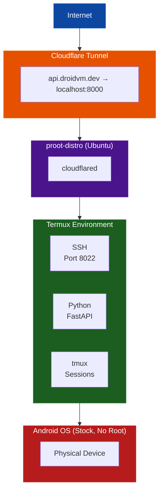

# DroidVM

> Turn your old Android phone into a home server. No root required.

[](https://api.droidvm.dev/status)
[](LICENSE)
[-blue>)](https://termux.dev)

---

## What is DroidVM?

DroidVM is a setup guide and script for turning an old Android phone into a mini home server using [Termux](https://termux.dev). Instead of letting your old phone collect dust, you can run a terminal emulator and host services from it.

The phone runs Termux - a Linux environment for Android. From there, you can SSH into it, run Python scripts, set up tunnels, and even expose services to the internet via Cloudflare Tunnel.

**Live Example:** [https://api.droidvm.dev/status](https://api.droidvm.dev/status) - A simple status API running on an actual phone at home.

---

## Why DroidVM?

- Old phone sitting in a drawer? Give it a purpose
- Learn how Linux, SSH, networking, and tunneling actually work
- No monthly cloud bills - you own the hardware
- Understand in-depth how home infrastructure can work
- Fun project to build

---

## Quick Start

```bash
# On your Android phone with Termux installed:
curl -fsSL https://raw.githubusercontent.com/myselfshravan/droidvm/main/setup.sh | bash
```

Or clone and run:

```bash
git clone https://github.com/myselfshravan/droidvm.git
cd droidvm
chmod +x setup.sh
./setup.sh
```

The interactive setup wizard guides you through:

1. Installing base packages (openssh, tmux, python, etc.)
2. Configuring SSH access on port 8022
3. Setting up tmux for persistent sessions
4. Installing Python environment with uv
5. Setting up proot-distro with Ubuntu
6. Optionally configuring Cloudflare Tunnel for public access
7. Optionally setting up Tailscale for VPN access

---

## What You Get

### Access Methods

| Method                | Use Case          | Example                        |
| --------------------- | ----------------- | ------------------------------ |
| **Local WiFi**        | Same network      | `ssh -p 8022 user@192.168.1.x` |
| **Tailscale VPN**     | Private, anywhere | `ssh -p 8022 user@100.x.x.x`   |
| **Cloudflare Tunnel** | Public internet   | `https://api.yourdomain.dev`   |

### Example: Status API

You can build a simple monitoring API:

```bash
curl https://api.droidvm.dev/status
```

Returns real-time info like memory usage, CPU cores, uptime, etc.

---

## Architecture



Traffic flows: Internet → Cloudflare Tunnel → cloudflared (running in Ubuntu proot) → Services in Termux → Android OS

---

## Requirements

### Hardware

- Android phone (Android 7+, tested on Android 14)
- ARM64 architecture (most modern phones)
- WiFi connection

### Software

- [Termux](https://f-droid.org/packages/com.termux/) (F-Droid version - Play Store version is outdated)
- Battery optimization **DISABLED** for Termux (important for keeping services running)
- (Optional) Cloudflare account for public domains
- (Optional) Tailscale account for private VPN

---

## Use Cases

- **Personal API server** - Host simple REST APIs
- **Webhook receiver** - GitHub, Stripe, Discord webhooks
- **Home automation** - Control IoT devices
- **Learning platform** - Practice Linux, networking, DevOps hands-on
- **File server** - Simple file sharing on your network

---

## Limitations

Due to Android/Termux sandboxing, some system info is unavailable:

**Not Available:**

- Battery info (can't access `/sys/class/power_supply`)
- CPU frequency (can't read kernel freq info)
- Network I/O counters (permission denied)
- Direct hardware sensor access (without Termux:API)

**Works Fine:**

- Memory usage (total, available, used)
- Process listing
- tmux session management
- Disk usage
- Network connectivity
- Running web servers

---

## Tech Stack

```yaml
Base: Android (stock, no root) + Termux
Linux: proot-distro with Ubuntu
Python: 3.12 with uv package manager
Server: Uvicorn (if running Python APIs)
Session: tmux
SSH: OpenSSH (port 8022)
VPN: Tailscale (optional)
Tunnel: Cloudflare Tunnel (optional)
```

**Note:** If using FastAPI, stick with Pydantic v1.x to avoid Rust compilation requirements on ARM.

---

## Documentation

- [Technical Context](docs/DROIDVM_CONTEXT.md) - Deep dive into the architecture
- [Open Source Plan](docs/OPEN_SOURCE_PLAN.md) - Project structure and plans
- [Project Summary](docs/PROJECT_SUMMARY.md) - High-level overview
- [Cloudflare Tunnel Guide](docs/context_cloudflare.md) - Setting up public domains
- [ngrok Setup Guide](docs/context_ngrok.md) - Alternative public access method

---

## Learn More About Termux

- [Termux Wiki](https://wiki.termux.com/wiki/Main_Page) - Official documentation
- [Termux:API](https://wiki.termux.com/wiki/Termux:API) - Access Android APIs from command line
- [What is Termux?](https://www.reddit.com/r/termux/comments/zi8j6p/what_is_termux_i_came_across_this_and_dont_know/) - Reddit discussion explaining Termux and all its potential.

---

## Contributing

Contributions welcome:

- Bug fixes
- Documentation improvements
- Testing on different devices
- Sharing your setup

Please open an issue or submit a PR.

---

## License

MIT License - See [LICENSE](LICENSE) file.

---

## Acknowledgments

- [Termux](https://termux.dev) - Terminal emulator for Android
- [Cloudflare](https://cloudflare.com) - Tunnel and DNS services
- [Tailscale](https://tailscale.com) - Zero-config VPN
- [FastAPI](https://fastapi.tiangolo.com) - Modern Python web framework
- [proot-distro](https://github.com/termux/proot-distro) - Linux distributions in Termux

---

## Why I Built This

Had an old phone lying around and wanted to see if I could actually run a web server on it and access it from the internet. Turns out you can.

The phone now sits at home, connected to WiFi and power, running a simple status API. It's not replacing a real server anytime soon, but it's satisfying to have built it. Learned a lot about SSH, tunneling, and working within Android's sandboxing limitations.

It was fun building this :)

---

_Built by [@myselfshravan](https://github.com/myselfshravan)_
